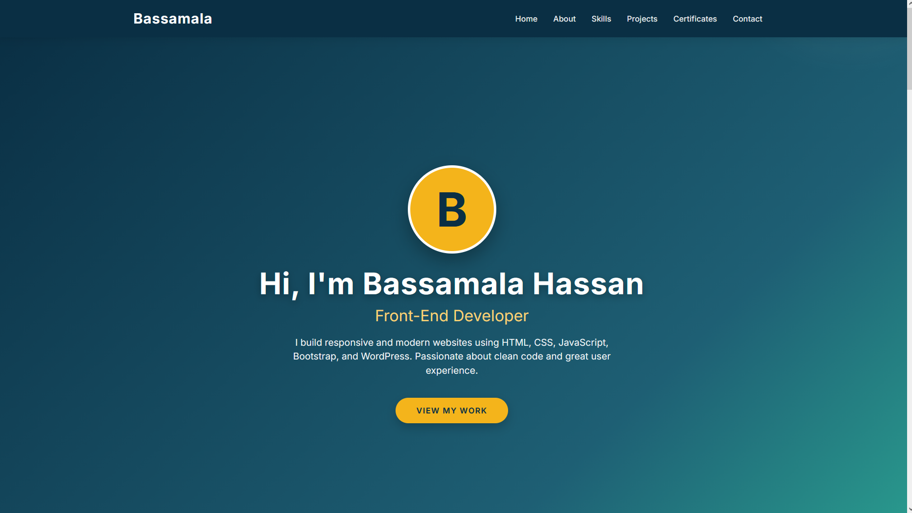
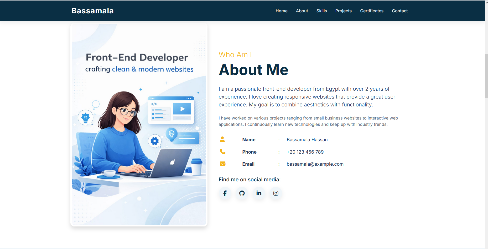
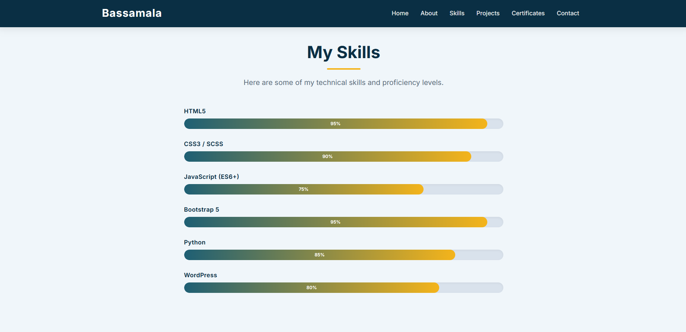
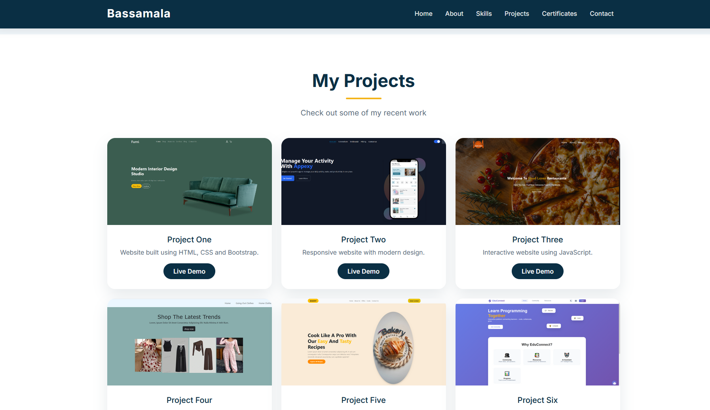
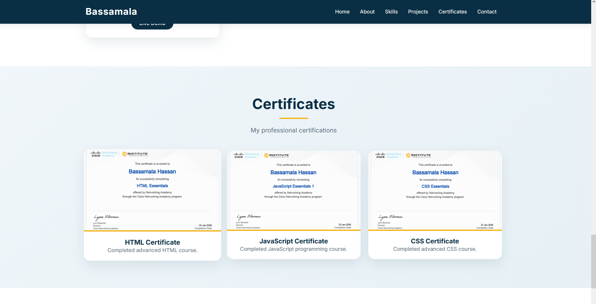
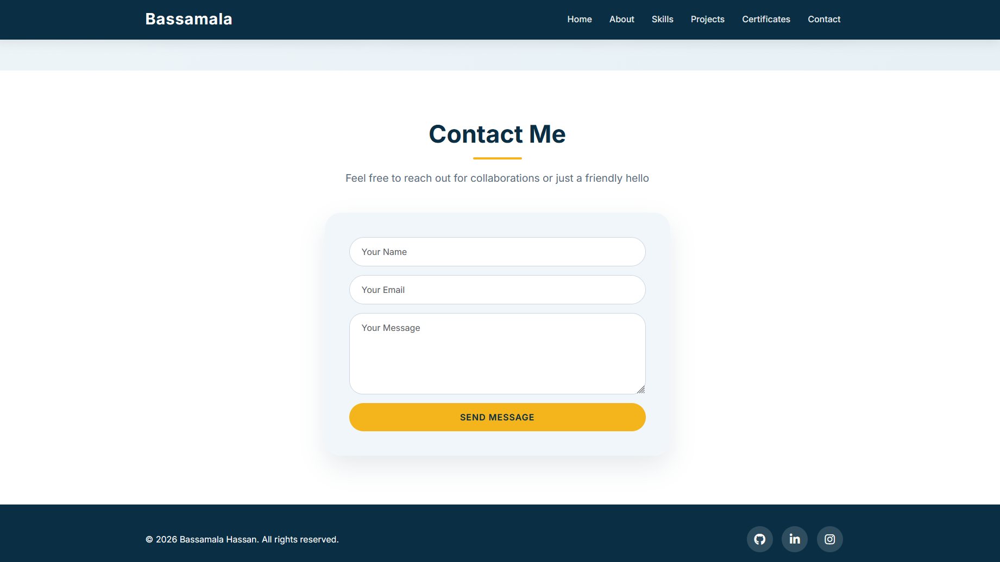

# 🌐 My Portfolio Website

My personal portfolio showcasing my skills, projects, and certificates as a front-end developer.

## 📸 Screenshots

| Home | About | Skills |
|------|-------|--------|
|  |  |  |

| Projects | Contact | Responsive |
|----------|--------|------------|
|  |  |  |

## 🔗 Live Demo

👉 [https://bassamalahassan955-cmd.github.io/MY-PORTFOLIO-/](https://bassamalahassan955-cmd.github.io/MY-PORTFOLIO-/)

## 🛠️ Technologies Used

- HTML5
- CSS3
- JavaScript
- Bootstrap

## ⚙️ Setup Instructions

1. **Clone the repository**  
   ```bash
   git clone https://github.com/bassamalahassan955-cmd/MY-PORTFOLIO-.git
